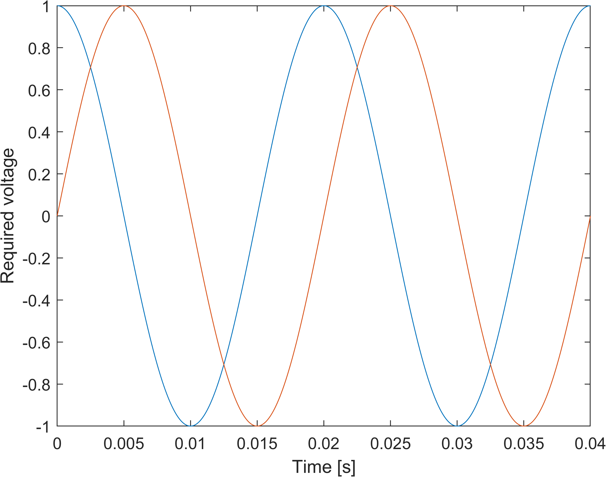
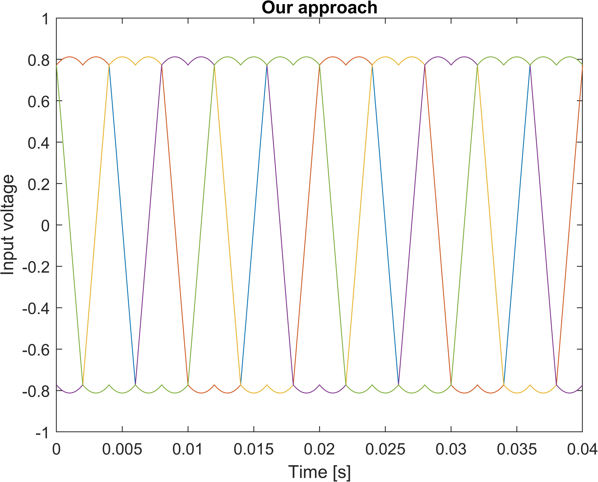
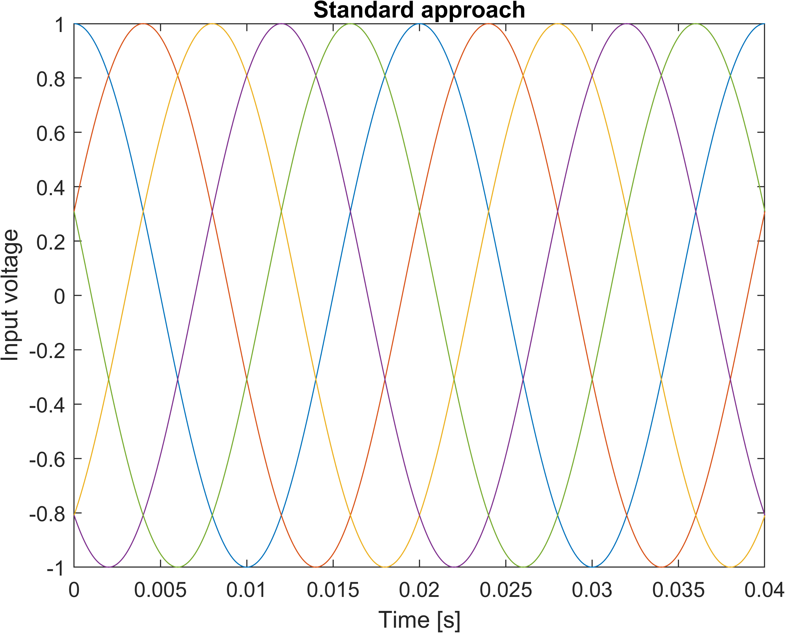
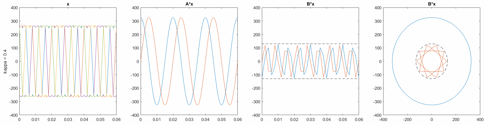

# Linear systems with the minimum infinity norm

This repo contains Matlab codes for finding the minimum infinity norm solution under linear constraints:

$$
\begin{align}
\text{minimize}\qquad &\Vert x\Vert_\infty \\
\text{subject to}\qquad &Ax = y, \\
&Bx \le z.
\end{align}
$$

The proposed algorithm is suited for repeated computations of small systems with the same matrices $A$ and $B$ but different right-hand sides $y$ and $z$. It can handle only small matrices (of size up to $10\times 10$), however, the computation for these matrices takes around $10-100\mu s$ when implemented in a microprocessor. For the detailed description of the algorithm see [our paper](https://ieeexplore.ieee.org/abstract/document/9880551).


## Algorithm

The algorithm is split into two phases:
- <b>Offline (slow) phase</b> preprocesses the matrices $A$ and $B$. This is the slow phase and may have significant memory requirements (see the variable `pars`).
- <b>Online (fast) phase</b> solves the problem for particular $y$ and $z$. This is the fast phase, where the solution can be found using basic operations (loops and mutliplications only) in a microprocessor within $10-100\mu s$.

## Application to multi-phase converters 1

Multi-phase converters can be written as a linear system. The goal is to compute the leg voltage values stored in the unknown vector ``x`` for the required output voltage vector stored in ``y``, where its components is the required voltage space vector in the stationary reference frame.



Since the infinity norm of x directly affects the minimum dc-link voltage needed, it is natural to minimize this quantity.

We create the matrix ``A`` based on the Clarke's transform for five-phase systems with degrees of freedom imposed on Vxy (voltage vector in x-y plane) and V0 (zero-sequence component), by omitting 3rd, 4th and 5th row of the matrix.

```
A = 2/5*[1, cos(2/5*pi), cos(4/5*pi), cos(-4/5*pi), cos(-2/5*pi);...
         0, sin(2/5*pi), sin(4/5*pi), sin(-4/5*pi), sin(-2/5*pi)];
B = [];
```

Now we perform time discretization of the interval ``[0, 0.04]`` and specify the right-hand side vectors ``y``.

```
ts = 0:100e-6:0.04;

[n_y, n_x] = size(A);
n_t = length(ts);

ys = zeros(n_y, n_t);
for k = 1:n_t
    wt = 2*pi*50*ts(k);
    ys(:,k) = 1*[cos(wt); sin(wt)];
end
```

The offline phase precomputes the variable  ``pars``.

```
pars = Pars(A, B);
solver = Solver(pars);
```

The online phase computes the optimal input voltage ``x`` for each realization of the output voltage ``y``.

```
xs = zeros(n_x, n_t);
for k = 1:n_t
    xs(:,k) = solver.min_effort(ys(:,k));
end
```

We compare our result with the standard method minimizing the l2 norm. We depict both results next to each other with the same y axis. Our approach leads to 18.7% lower dc-link voltage, which means significant costs savings.



## Application to multi-phase converters 2

Instead of completely omitting the 3rd and 4th rows of the matrix, we can consider them. When we put them into a matrix ``B = A([3 4, :])``, we may prescribe the maximum norm ``norm(B*x) <= kappa*U_max``. When we increase ``kappa``, the input voltage ``x`` decreases but some additional properties such as THD may increase. Therefore, ``kappa`` may be understood as a tuning parameter to be determined according to the needs of the user. The following animation shows how the system behaves when ``kappa`` is decreased.



## Citation

If you like our package, please cite our [paper](https://ieeexplore.ieee.org/abstract/document/9880551).

```
@article{komrska2022multiphase,
  title={Multiphase converter voltage optimization with minimum effort principle},
  author={Komrska, Tom{\'a}{\v{s}} and Adam, Luk{\'a}{\v{s}} and Peroutka, Zden{\v{e}}k},
  journal={IEEE Transactions on Industrial Electronics},
  volume={70},
  number={7},
  pages={6461--6469},
  year={2022},
  publisher={IEEE}
}
```
