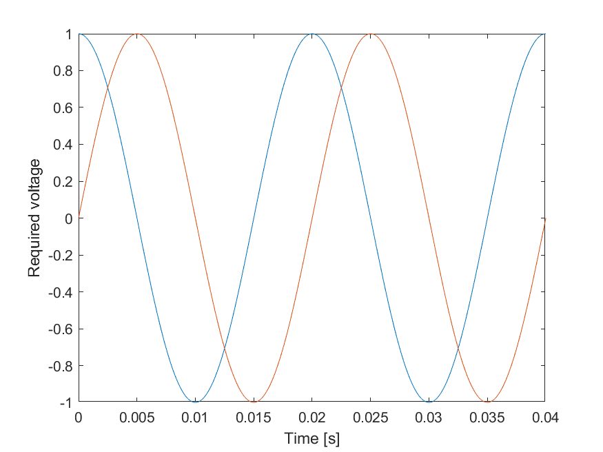
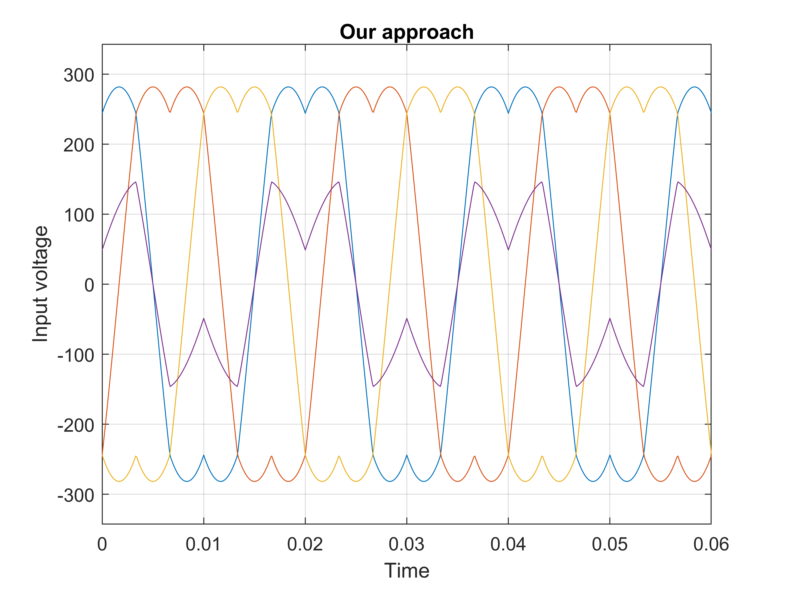
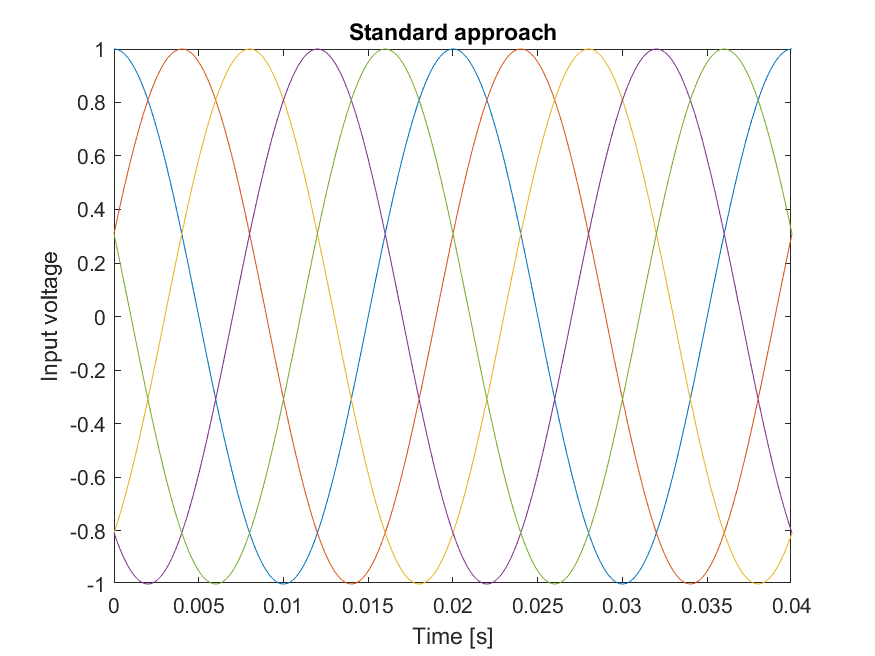

# Linear systems with the smallest infinity norm

This repo contains Matlab codes for finding the solution of linear system ``Ax = y`` with the smallest infinity norm. Due to the split to online and offline phase, our algorithm is suited for repeated computations of this system with the same matrix ``A`` but different right-hand side ``y``. See more detailed information in our paper.

## Algorithm

The problem can be written as a linear optimization problem. The theory of linear programming states that this problem is equivalent to its dual problem. Our algorithm is based on the idea that the dual problem has only a finite number of possible solutions ``u``. We divide the algorithm into two phases:
- <i>Offline phase</i>: We compute all possible dual solutions and save them into a matrix ``U``.
- <i>Online phase</i>: When the right-hand side ``y`` gets known, we select the optimal solution ``u`` from the precomputed set ``U`` and based on the complementarity conditions, we recover the primal solution ``x``.

## Application to multi-phase converters

Multi-phase converters can be written as a linear system. The goal is to compute the input voltage ``x`` for the required voltage ``y``. Since the infinity norm amounts to the dc-link, it is natural to minimize this quantity.

We saved several possible configurations in the ``get_a`` function. The selected matrix describes a fault-tolerant system with four phases. We load the matrix.

```
A = get_a(6);
[m, n] = size(A);
```

Now we perform time discretization of the interval ``[0, 0.06]`` and specify the right-hand side vectors ``y``.

```
ts = 0:100e-6:0.06;
N = length(ts);

ys = zeros(m,N);
for k = 1:N
    wt = 2*pi*50*ts(k);
    ys(:,k) = 230*sqrt(2)*[cos(wt); sin(wt); -0.4*cos(wt)];
end
```



The offline phase precomputes the matrix ``U``.

```
U = get_u(A);
```

The online phase computes the optimal input voltage ``x`` for each realization of the output voltage ``y``.

```
xs = zeros(n,N);
for k = 1:N
    xs(:,k) = solve_ours(A, ys(:,k), U);
end
```

We compare our result with the standard method minimizing the l2 norm. We depict both results next to each other with the same y axis. Our approach leads to 18% smaller dc-link.




