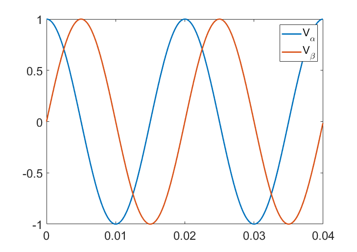
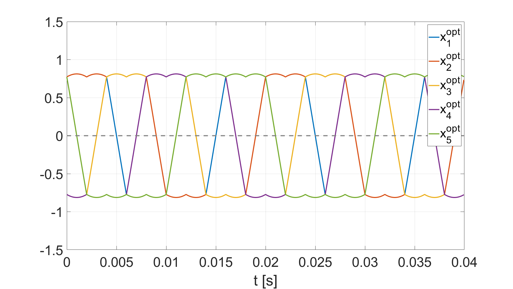
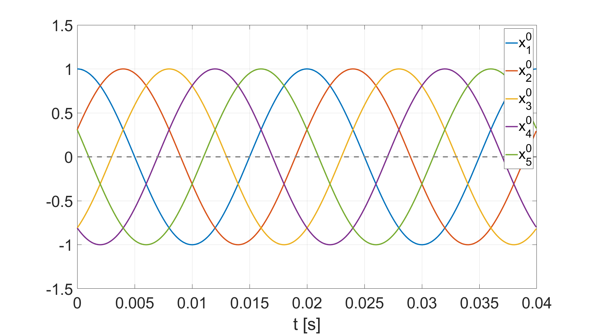
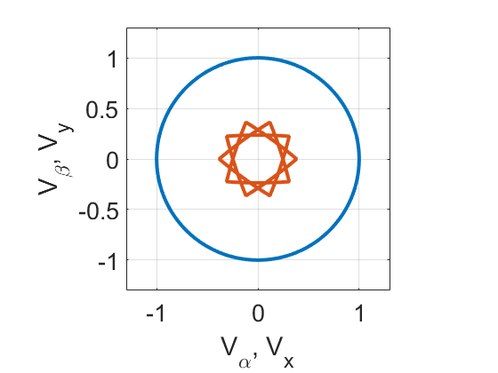

# Linear systems with the minimum infinity norm

This repo contains Matlab codes for finding the solution of the linear system ``Ax = y`` with the smallest infinity norm. Due to splitting the computation to online and offline phases, our algorithm is suited for repeated computations of this system with the same matrix ``A`` but different right-hand side ``y``. See more detailed information in our paper.

## Algorithm

The problem above can be written as a linear optimization problem. The theory of linear programming states that it is equivalent to its dual problem. Our algorithm is based on the idea that when ``A`` is fixed, the dual problem has only a finite number of possible solutions ``u``. We divide the algorithm into two phases:
- <i>Offline phase</i>: We compute all possible dual solutions and save them into a matrix ``U``.
- <i>Online phase</i>: When the right-hand side ``y`` gets known, we select the optimal solution ``u`` from the pre-computed set ``U`` and based on the complementarity conditions, we recover the primal solution ``x``.

## Application to multi-phase converters

Multi-phase converters can be written as a linear system. The goal is to compute the leg voltage values stored in the unknown vector ``x`` for the required output voltage vector stored in ``y`` (''y(1)'' = Valpha, ''y(2)'' = Vbeta, where Valpha and Vbeta are the components of the required voltage space vector in the stationary reference frame (see Fig. 1 for unit circle trajectory of ''Vafbt'').



Since the infinity norm of x directly affects the minimum dc-link voltage needed, it is natural to minimize this quantity.

We create the matrix ``A`` based on the Clarke's transform for five-phase systems with degrees of freedom imposed on Vxy and V0 (by omitting 3rd, 4th and 5th row).

```
A = 2/3*[1, cos(2/3*pi), cos(4/3*pi), cos(-4/3*pi), cos(-2/3*pi);...
         0, sin(2/3*pi), sin(4/3*pi), sin(-4/3*pi), sin(-2/3*pi)];    
[m, n] = size(A);
```

Now we perform time discretization of the interval ``[0, 0.04]`` and specify the right-hand side vectors ``y``.

```
ts = 0:100e-6:0.04;
N = length(ts);

ys = zeros(m,N);
for k = 1:N
    wt = 2*pi*50*ts(k);
    ys(:,k) = 1*[cos(wt); sin(wt)];
end
```

The offline phase precomputes the matrix ``U``. It has only 10 elements, which means that the dual problem can be solved in 10 dot products. Our basic Matlab implementation needs only 0.05ms for one solution on a laptop.

```
U = get_u(A);
```

The online phase computes the optimal input voltage ``x`` for each realization of the output voltage ``y``.

```
xs = zeros(n,N);
for k = 1:N
    xs(:,k) = min_effort(A, ys(:,k), U);
end
```

We compare our result with the standard method minimizing the l2 norm. We depict both results next to each other with the same y axis. Our approach leads to 18.7% lower dc-link voltage, which means significant costs savings.



The trajectory of the final output voltage vector in the alpha-beta (blue) and x-y (orange) plane is depicted below. The orange curve show the exploitation of degrees of freedom imposed on the Vxy.




